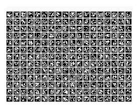

# tobor_opencv_calibration_test
series of utilities for calibrating tobor 

This repository contains a series of utilities for calibrating the tobor robot's vision and motion systems using OpenCV. 

It includes a tool for generating AprilTag grids in [helpers/apriltag_generator](helpers/apriltag_generator), which can be printed and used for calibration. 

Example aprilag grid generated by the tool:

Example usage and instructions will be provided in future updates.