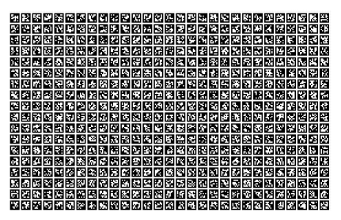

## apriltag_generator

 This is a helper script to generate AprilTag markers for camera calibration.

 The script generates a grid of AprilTag markers and saves them as an SVG file. The generated tags can be printed and used for camera calibration.

 ### Requirements

 - Python 3.x
 - OpenCV
 - NumPy
 - svgwrite

 ### Usage

 1. Run the script to generate the AprilTag markers:

    ```bash
    python apriltag_generator.py
    ```

 2. The generated SVG file will be saved in the `output` directory.

 ### Configuration

 You can modify the following parameters in the script to customize the generated tags:

 - `TAG_SIZE_MM`: Size of each tag in millimeters.
 - `TAG_PIXELS`: Raster resolution per tag.
 - `GRID_PITCH_MM`: Distance between the centers of adjacent tags in millimeters.
 
     The grid pitch is intended to be used as a reference for Z-plane surface compensation

 - `MARGIN_MM`: Printer margin around the grid in millimeters.

### Output
Example of a generated AprilTag letter paper sized grid:


Example of a generated AprilTag tabloid paper sized grid:


Each output file also contains corresponding a json file with metadata about the generated grid, including tag IDs and their positions.

```json
{
  "page": "letter",
  "page_size_mm": [279.4,215.9],
  "margin_mm": 12.7,
  "usable_area_mm": [253.999,190.5],
  "apriltag_family": "tag36h11",
  "tag_size_mm": 12.0,
  "grid_pitch_mm": 2.0,
  "origin": "bottom-left",
  "tags": [
    {"id": 0,
     "center_mm": [6.0,6.0],
      "corners_mm": [
        [0.0,0.0],
        [12.0,0.0],
        [12.0,12.0],
        [0.0,12.0]
      ],
      "rotation_deg": 0.0
    }
    ...continued
```